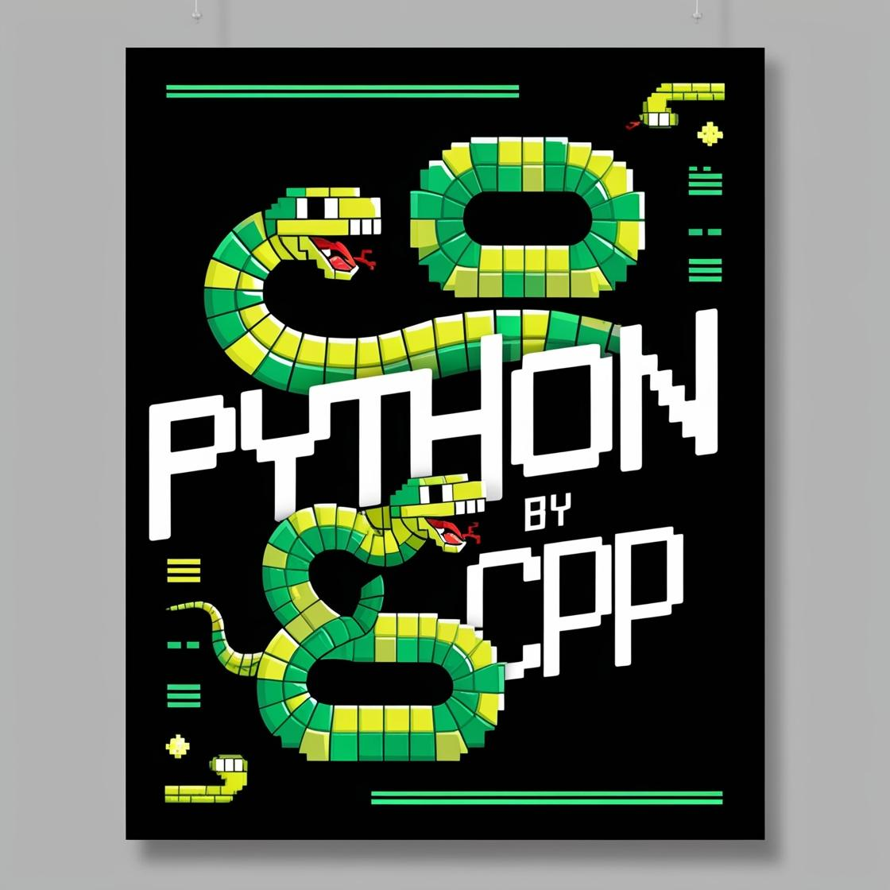

# Game Name
Python by C++ is a windows-terminal based snake game.


## Description
Python by C++ is a terminal based, live and interactive snake game. Our goal was to make the project without using any external libraries and GUI, and mostly use the fundamentals of programming such as standard I/O, standard OOP concepts, etc. Note that it only runs on Windows.

## Features of Python by C++
### 1. Dynamic snake length
The length of snake increases as it eats the food. This makes it challenging to survive in the grid without colliding.
### 2. Customizability
Python by C++ provides the ability to change the grid sizes, that is height and width can be changed to any satisfactory number, and also alter speed of snake.
### 3. Attractive UI
Python by C++ has implemented the use of ANSI colors to make the game look appealing enough in a terminal.
### 4. Sound effects
We used the Beep function from windows header to make a beep sound whenever the player collides with a wall and the game is over.

## Installation
### 1. Prerequisites
1. C++ compiler (VS Code recommended)
2. Windows OS as <windows.h> is used.
### 2. Steps to install
Open terminal and cd to directory where you want to install the game.
Then, do
```sh
git clone https://github.com/yugprajapati212/Python-by-CPP
```

Now compile the cpp file:
```sh
g++ snake.cpp -o snakegame
```


The game should be installed. To run it type
```sh
./snakegame
```
## How to play Python by C++
The snake will intially be of size 1 cell then it will grow each time it consumes a point. The more points it consumes and bigger it gets, more the score is done, and it keeps getting tougher to keep the game going. For movement of snake, usage of W, A, S, D keys is done. W for going upwards, S for downwards, A for right and D for left. The goal is to eat as many points as possible until the snake collides with obstacles or itself.

## Technologies used
Python by C++ is made primarily with C++ and uses the windows header file <windows.h> along with <conio.h> to enable live input from the player, flush the text based UI output of the game at a live moment, use colors by ANSI codes and Beep() function under the windows header.

## Analysis of data structures
We have used vector containing pair of int as the data structure for snake. For checking the collisions, we iterate through all pairs and check if the grid x,y is responsible for collision or not. In this way our time complexity is O(n) as we check through the complete snake.
